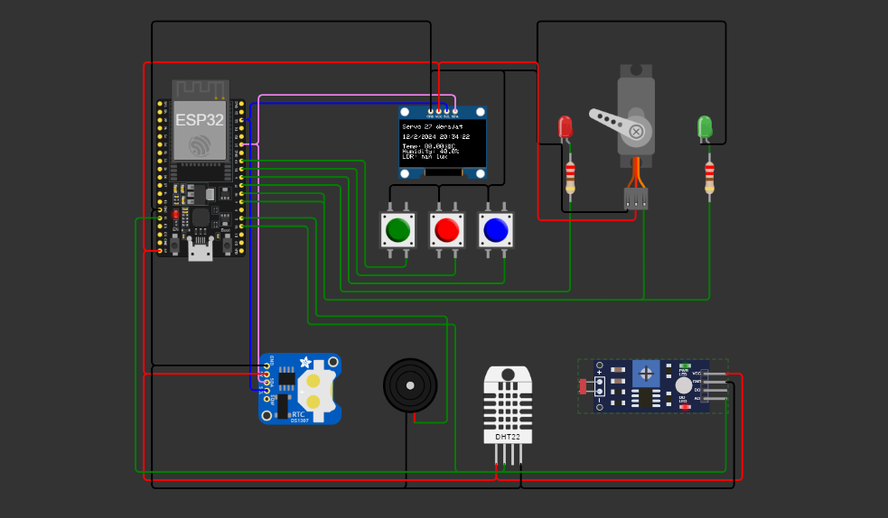

# Tugas Intern 1 VIROSE

## Komponen Board

- ESP32
- OLED Display
- 3 Push Button
- Sensor DHT, RTC, LDR
- LED Merah dan Hijau
- Servo

## Kondisi Awal

Pada kondisi awal, OLED Display menampilkan tampilan utama berupa waktu sekarang yang diperoleh dari RTC.

## Mode dan Penggunaan Push Button

- **Button 1**: Masuk ke menu opsi mode (display).
- **Button 2**: Pergi ke atas dalam menu opsi.
- **Button 3**: Pergi ke bawah dalam menu opsi.
- **Button 1 (long press)**: Kembali ke menu sebelumnya.

## Opsi Mode

### Mode 1: Input dari DHT

- OLED menampilkan data suhu dan kelembaban dari sensor DHT, beserta status (dingin, netral, hangat, panas).
- Animasi tampilan pada OLED.
- Pergerakan servo diatur mengikuti set suhu dari sensor DHT; jika nilai minimum, servo bergerak ke kiri, dan sebaliknya.
- LED merah dan hijau digunakan untuk mengidentifikasi nilai DHT; jika kurang dari nilai tengah DHT, LED merah menyala, jika lebih dari nilai tengah DHT, LED hijau menyala (mengikuti pergerakan servo dalam gambar).

### Mode 2: Input dari LDR

- OLED menampilkan nilai intensitas cahaya yang diperoleh dari sensor LDR (nilai lux dan status 'gelap' atau 'terang').
- Pergerakan servo diatur mengikuti nilai intensitas cahaya; jika nilai minimum, servo bergerak ke kiri, dan sebaliknya.
- LED merah dan hijau digunakan untuk mengidentifikasi nilai lux; jika kurang dari nilai tengah DHT, LED merah menyala, jika lebih dari nilai tengah DHT, LED hijau menyala (mengikuti pergerakan servo dalam gambar).

### Mode 3: Setting Alarm

- Konfigurasi setting alarm pada OLED menggunakan RTC dan push button.
- Jika waktu sekarang sama dengan waktu alarm, tampikan pesan "Alarm!" pada OLED.

### Default Mode: Waktu

- OLED menampilkan tampilan utama berupa waktu sekarang yang diperoleh dari RTC.
- Jika tidak ada input button selama 30 detik, kembali ke tampilan waktu.

## Tambahan

- Diharuskan minimal terdapat satu fitur tambahan sesuai dengan kreatifitas masing-masing. Boleh dari memodifikasi audio (mungkin diberikan irama), menambahkan game dalam oled (mode baru), menambahkan animasi, atau fitur tambahan lainnya.

- Tidak diperbolehkan mengurangi board yang sudah disediakan.

- Diperbolehkan untuk menambahkan input/output tambahan dari wokwi (misalnya sensor suhu tambahan, LED tambahan, dsb) jika diperlukan.
